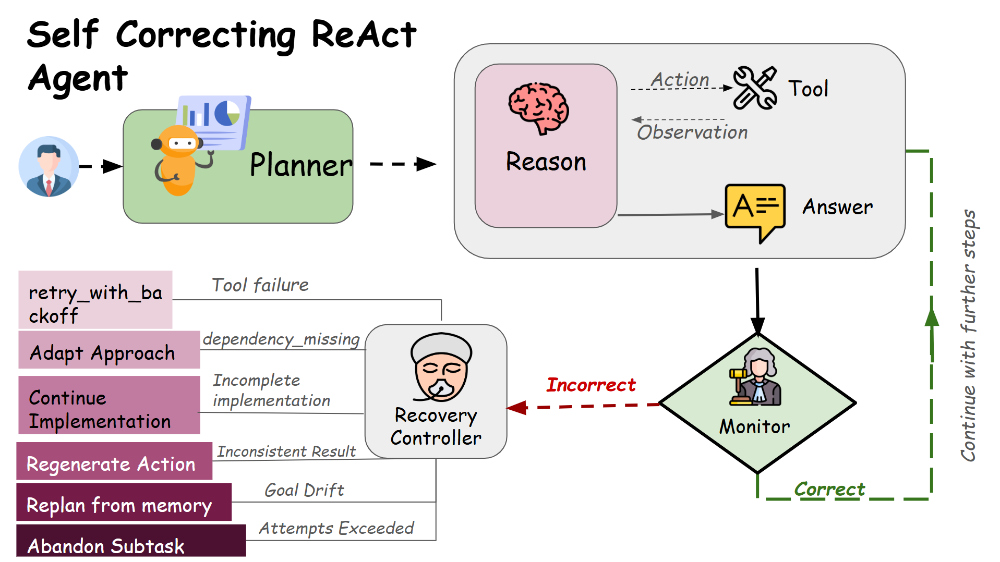

# Self-Correcting Multi-Step Coding Agent

A hand-rolled ReAct agent (no LangChain/LlamaIndex/AutoGen/CrewAI) that writes code,
executes it in a real subprocess sandbox, judges its own results with an independent
monitor, and recovers from failure without a human in the loop, plus a live chat
playground that streams the reasoning trace as it happens.


## Project Structure
```
heva_agent/
├── .env                    # OPENROUTER_API_KEY / OPENROUTER_MODEL / LLM_MODE
├── pyproject.toml
├── run_evaluation.py        # runs the 10-goal eval, self-correct vs baseline
├── static/index.html        # chat playground frontend (live trace viewer)
├── tests/                   # unit tests for tools + recovery decision logic
├── logs/                    # structured JSON run logs (generated)
├── sandbox_workspace/       # where the agent actually writes/executes code (generated)
└── src/
    ├── config.py             # env validation, fails fast on bad config
    ├── schemas.py             # Pydantic models for the whole state/memory lifecycle
    ├── llm.py                 # OpenRouter client
    ├── tools.py                # typed tools + subprocess execution + the flaky tool
    ├── monitor.py               # independent Judge: self-eval + recovery strategy selection
    ├── agent.py                  # the ReAct state machine / main loop
    ├── log_viewer.py              # rich CLI table + HTML renderer (shared by server + CLI)
    └── server.py                   # FastAPI chat playground (websocket live trace)
```

## Quickstart

```bash
pip install -e .
# edit .env with a real OPENROUTER_API_KEY (get one at https://openrouter.ai/keys)

# 1. Chat playground (live reasoning trace in the browser)
python -m uvicorn src.server:app
# open http://localhost:8000  (do not use --reload)

# 2. CLI evaluation (10 goals x self-correct/baseline)
python run_evaluation.py

# 3. View a structured log from the terminal
python -m src.log_viewer latest      # or a specific run_id, or "all"
```

## Domain

**Code generation and execution.** The agent is given a natural-language coding goal
("write a function that X, with tests"), and must: write a module, execute it, write a
test file, run the tests, and validate a final report: a genuine 5+ step task where
failure is observable (exceptions, non-zero exit codes, failing assertions) rather than
just "the LLM said something wrong."

## Agent architecture

**ReAct loop.** Every step produces a visible `thought` (the reasoning trace) before
`tool_name` / `tool_input` (the action) are ever executed. The thought is generated by a
dedicated LLM call (`Agent._reason`, `REASONER_SYSTEM_PROMPT`) and logged verbatim in
`StepLog.reasoning.thought` before the tool runs. It is not a reformatted version of the
tool's output; it's produced *before* the observation exists.

**Working memory** is an explicit Pydantic structure (`WorkingMemory` in `schemas.py`),
not raw conversation history: a goal string, a list of typed `MemoryEntry` objects
(`observation` / `correction` / `unresolved`), and separate `completed_step_ids` /
`unresolved_step_ids` lists. `WorkingMemory.as_context_string()` renders it for injection
into prompts, but the structure itself is queryable and inspectable independent of any
LLM call.

**Typed, validated tools.** Every tool in `tools.py` has a Pydantic input and output
model. `call_tool()` is the single dispatch point: it validates the proposed
`tool_input` against the tool's input schema and *never* lets an exception escape.
A malformed schema, a missing file, a timeout, or a crashing subprocess all come back as
`ToolResult(success=False, error=...)` rather than crashing the agent loop.

## Self-correction mechanism

After every tool call, `Monitor.evaluate()` (in `monitor.py`), a component that did
*not* produce the action and has no stake in defending it, independently judges three
things: did the action succeed, does the result plausibly satisfy the step's intent, and
is the plan still on track toward the original goal. It classifies the result into one
of **five distinct failure modes**, each mapped to a **structurally different** recovery
strategy. This is not "retry with a different prompt" repeated five times:

| Failure mode | What it means | Recovery strategy | What actually happens |
|---|---|---|---|
| `tool_failure` | The tool itself raised/crashed/timed out | `retry_with_backoff` | Replays the *identical* action against the *same* tool after a short backoff. No re-reasoning: the plan and the code were fine, the environment hiccuped (this is what the flaky tool exercises). |
| `dependency_missing` | The chosen tool/library isn't available in this environment | `adapt_approach` | Re-reasons with an explicit instruction to avoid that tool/library entirely and find a genuinely different route to the step's goal. The action itself must change, not just its arguments. |
| `incomplete_implementation` | The tool "succeeded" but wrote a stub/placeholder instead of real logic | `continue_implementation` | Re-reasons with the current file contents from working memory as its base, explicitly told to replace every stub/TODO with complete, working logic. |
| `result_inconsistency` | The tool succeeded but its output contradicts the step's intent (e.g. pytest ran but reported failures) | `regenerate_action` | Re-invokes the reasoning step with the judge's rationale injected as error context, forcing a *different* action, not a blind repeat. |
| `goal_drift` | The plan itself has wandered from the original goal | `replan_from_memory` | A dedicated LLM call rebuilds the *remaining* plan from working memory, discarding the drifted steps, grounded in what's actually been done so far. |

A **replanning budget** (`MAX_REPLAN_ATTEMPTS`, default 3, in `.env`) caps how many
recovery attempts a single subtask gets, regardless of failure mode. Once exceeded,
`decide_recovery()` in `monitor.py` returns `abandon_subtask`: the step is marked
`unresolvable`, logged into `WorkingMemory.unresolved_step_ids`, and the agent continues
with the rest of the plan rather than looping forever. There is also a hard ceiling
(`MAX_TOTAL_STEPS = 40` in `agent.py`) as a last-resort guard against any pathological
loop the budget logic didn't anticipate.

Both the reasoning call and the judge call are themselves wrapped so that an LLM-side
hiccup (rate limit, malformed completion) is treated as a `tool_failure` and routed
through the same recovery machinery, rather than raising an exception that kills the run.

**The intentionally broken tool** is `flaky_read_report` in `tools.py`: it raises a
simulated `ConnectionError` on ~35% of calls, independent of its input. It's used as the
final "read back the report" step in the default plan, and is what reliably produces
`tool_failure → retry_with_backoff` corrections during a run.

## Why this isn't just a retry loop

A retry loop reruns the same prompt hoping for a different sample. This system:

1. Uses a **different corrective instruction per failure mode**: replay-unchanged,
   avoid-this-tool, complete-the-stub, fix-what's-wrong, or rebuild-the-plan, not the
   same call again.
2. Explicitly **injects the error as context** for the re-reasoning modes, so the retried
   action is causally informed by what went wrong, not blind.
3. Can **change the plan itself** (`replan_from_memory`), not just the last action,
   something a retry loop structurally cannot do.
4. Has a **budget that terminates into a different state** (`unresolvable`, not an
   exception, not an infinite loop): the failure is documented, not hidden.
5. The judge is **structurally separate** from the actor: it doesn't get to reuse the
   reasoning that produced the action to justify it; it starts from goal + memory +
   raw tool result.

## Playground

`uvicorn src.server:app` serves a live chat playground: submit a goal, and a websocket
streams every `thought` / `action` / `observation` / `self_evaluation` / `recovery` /
`replan` event into the browser as it happens, rendered as trace cards in real time.

A **self-correction checkbox** sits above the goal input. Leave it checked to run the
full judge-and-recover pipeline described above; uncheck it to run the baseline instead,
where the agent executes tools for real but accepts whatever comes back, success or
failure, without evaluation or recovery. Toggling it per run is the intended way to see
the difference side by side, rather than reading the two modes off separate logs.

When a run finishes, the final answer isn't just prose: the response includes the full
structured log for that run, every reasoning trace, action, observation, self-evaluation,
and recovery decision, in order, so the whole decision chain that produced the answer is
inspectable, not just the answer itself. The sidebar links back to every past run's log
in the same format.

**Demo:** [](https://youtu.be/fIxCKuV5Ipw)

Watch the agent build another self-correcting ReAct coding agent from scratch, live, using a real LLM end-to-end. Since every step involves model inference, there is noticeable latency between actions. **Watching at 2× speed (or faster) is recommended.**

## Evaluation

`run_evaluation.py` runs the agent on 10 distinct goals, twice each (self-correction on
vs off / baseline), persists every run's structured log to `logs/<run_id>.json`, and
writes `eval_report.md`.

Reproduce with:

```bash
python run_evaluation.py
```

Numbers in `eval_report.md` reflect whichever evaluation run generated it and will shift
between runs (LLM sampling, flaky-tool timing, etc.); see that file directly for the
current completion rates, self-correction counts, and per-goal breakdown rather than a
snapshot pasted here.

## Observability

Every run produces `logs/<run_id>.json`, a `RunLog` (`schemas.py`) containing: goal,
plan, every `StepLog` (reasoning trace, tool result, self-evaluation, recovery), total
self-corrections, unresolved subtasks, and final output.

Two viewers, sharing the same renderer:
- **CLI**: `python -m src.log_viewer <run_id | latest | all>`, a `rich` table.
- **HTML**: `GET /logs/<run_id>` on the running server, or call
  `render_run_log_html()` directly to export a standalone file.

## What can be improved?

- **Parallel/branching recovery**: `regenerate_action` currently retries serially within
  the same step; for expensive tool calls it'd be worth generating 2-3 candidate
  regenerations and letting the judge pick the best, rather than accept-first.
- **Judge calibration**: the `confidence` field is currently advisory only; it's logged
  but doesn't affect control flow. A natural next step is routing low-confidence
  judgments to a stricter/second-opinion check before committing to a recovery strategy.
- **Cost/latency tracking**: the run log doesn't currently record token usage or per-call
  latency, which would matter a lot for a production version of the budget logic (a
  wall-clock or cost budget alongside the attempt-count budget).
- **Richer goal-drift detection**: the current judge sees the whole plan + memory every
  time, which works at this scale but would get expensive/noisy on much longer-horizon
  tasks; a cheaper drift heuristic (e.g. embedding similarity between step descriptions
  and the original goal) could pre-filter before invoking the LLM judge.
- **Sandbox hardening**: `execute_python`/`run_tests` run in a subprocess with a timeout
  but no resource limits (memory/CPU) or network isolation beyond the container's own
  egress rules: fine for this assignment's scope, not fine for untrusted input in
  production.
*Note on scope and capability: The logs and transcripts were generated from small open-weight models, which have far lower instruction-following capabilities than frontier models (e.g., Claude Sonnet or GPT-5 Nano). The current evaluation is limited by available resources and inference costs.*
